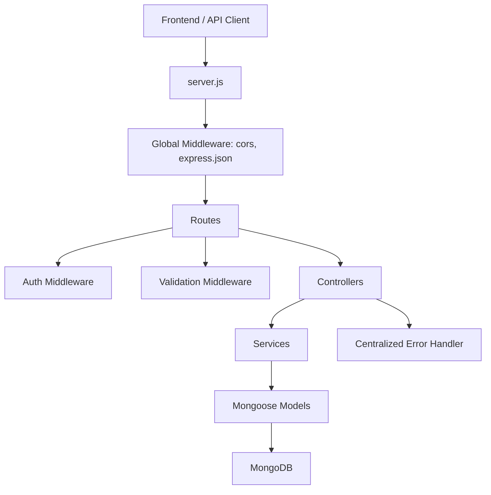

# Axora Backend API

## Overview

Axora Backend API is the backend service for a full-stack MERN project management application built for an internship interview assignment.

The API supports user authentication, project creation, project member management, and task management with MongoDB-backed relationships between users, projects, and tasks. It follows a clean Express architecture with separate route, controller, service, model, middleware, validator, and utility layers.

## Features

- User signup and login
- JWT-based authentication
- Password hashing using `bcryptjs`
- Protected API routes using Bearer tokens
- Current authenticated user profile endpoint
- Project creation and listing
- Project detail retrieval for project members
- Owner/member role model for projects
- Owner-only member addition by email
- Task creation, listing, updating, and deletion
- Task assignment to project members
- Task filtering by status, priority, assignee, and search keyword
- Project search by name or description
- Pagination support for project and task lists
- Request validation using `express-validator`
- Centralized error handling middleware
- MongoDB relationships using Mongoose references and population
- Environment-based configuration with `dotenv`

## Tech Stack

| Layer | Technology |
|---|---|
| Runtime | Node.js |
| Framework | Express.js |
| Database | MongoDB |
| ODM | Mongoose |
| Authentication | JSON Web Token |
| Password Hashing | bcryptjs |
| Validation | express-validator |
| Environment Config | dotenv |
| CORS | cors |
| Module System | ES Modules |

## Backend Architecture



The backend uses a layered structure:

- `server.js` initializes Express, loads environment variables, connects MongoDB, registers routes, and attaches the error handler.
- Routes define endpoint paths and middleware chains.
- Controllers handle request/response flow.
- Services contain business logic such as project membership checks, task assignment validation, pagination, and database queries.
- Models define MongoDB schemas and relationships.
- Middleware handles authentication, validation, and errors.

## Folder Structure

```bash
backend/
├── server.js
├── package.json
├── package-lock.json
├── .env
├── .gitignore
└── src/
    ├── config/
    │   └── db.js
    ├── constants/
    │   └── index.js
    ├── controllers/
    │   ├── authController.js
    │   ├── projectController.js
    │   └── taskController.js
    ├── middleware/
    │   ├── auth.js
    │   ├── errorHandler.js
    │   └── validate.js
    ├── models/
    │   ├── Project.js
    │   ├── Task.js
    │   └── User.js
    ├── routes/
    │   ├── authRoutes.js
    │   ├── projectRoutes.js
    │   └── taskRoutes.js
    ├── services/
    │   ├── projectService.js
    │   └── taskService.js
    ├── utils/
    │   ├── generateToken.js
    │   └── pagination.js
    └── validators/
        ├── projectValidators.js
        └── taskValidators.js
```

## Database Models

### User

| Field | Type | Rules |
|---|---|---|
| `name` | String | Required |
| `email` | String | Required, unique |
| `password` | String | Required, hashed before storing |
| `createdAt` | Date | Auto-generated |
| `updatedAt` | Date | Auto-generated |

### Project

| Field | Type | Rules |
|---|---|---|
| `name` | String | Required |
| `description` | String | Defaults to empty string |
| `owner` | ObjectId | References `User`, required |
| `members` | Array | Embedded project member objects |
| `createdAt` | Date | Auto-generated |
| `updatedAt` | Date | Auto-generated |

Project member structure:

```js
{
  user: ObjectId, // references User
  role: "owner" | "member"
}
```

Project indexes:

- `owner`
- `members.user`
- text index on `name` and `description`

### Task

| Field | Type | Rules |
|---|---|---|
| `project` | ObjectId | References `Project`, required |
| `title` | String | Required, 2-160 characters |
| `description` | String | Max 2000 characters |
| `priority` | String | `Low`, `Medium`, `High`, `Urgent` |
| `dueDate` | Date | Required |
| `assignedTo` | ObjectId | References `User`, required |
| `status` | String | `Todo`, `In Progress`, `Done` |
| `createdBy` | ObjectId | References `User`, required |
| `updatedBy` | ObjectId | References `User` |
| `createdAt` | Date | Auto-generated |
| `updatedAt` | Date | Auto-generated |

Task indexes:

- `project`
- `project + status`
- `project + priority`
- `project + assignedTo`
- text index on `title` and `description`

## API Endpoints

Base URL:

```bash
http://localhost:5000
```

### Health Check

| Method | Endpoint | Access | Description |
|---|---|---|---|
| GET | `/` | Public | Confirms that the API is running |

Response:

```text
API Running...
```

### Authentication Endpoints

| Method | Endpoint | Access | Description |
|---|---|---|---|
| POST | `/api/auth/signup` | Public | Register a new user |
| POST | `/api/auth/login` | Public | Login an existing user |
| GET | `/api/auth/me` | Protected | Get current authenticated user |

#### Signup Request

```json
{
  "name": "Vansh Kakkar",
  "email": "vansh@example.com",
  "password": "password123"
}
```

#### Signup Response

```json
{
  "_id": "665f1d25c2b6f9448b5f1111",
  "name": "Vansh Kakkar",
  "email": "vansh@example.com",
  "token": "jwt_token_here"
}
```

#### Login Request

```json
{
  "email": "vansh@example.com",
  "password": "password123"
}
```

#### Login Response

```json
{
  "_id": "665f1d25c2b6f9448b5f1111",
  "name": "Vansh Kakkar",
  "email": "vansh@example.com",
  "token": "jwt_token_here"
}
```

#### Current User Response

```json
{
  "user": {
    "_id": "665f1d25c2b6f9448b5f1111",
    "name": "Vansh Kakkar",
    "email": "vansh@example.com",
    "createdAt": "2026-05-13T06:30:00.000Z",
    "updatedAt": "2026-05-13T06:30:00.000Z"
  }
}
```

### Project Endpoints

All project routes require authentication.

| Method | Endpoint | Access | Description |
|---|---|---|---|
| GET | `/api/projects` | Protected | List projects where the user is a member |
| POST | `/api/projects` | Protected | Create a new project |
| GET | `/api/projects/:projectId` | Protected, project member | Get project details |
| POST | `/api/projects/:projectId/members` | Protected, project owner | Add an existing user as a project member |
| GET | `/api/projects/:projectId/tasks` | Protected, project member | List tasks for a project |
| POST | `/api/projects/:projectId/tasks` | Protected, project member | Create a task inside a project |

Project list query parameters:

| Query | Description |
|---|---|
| `page` | Page number, defaults to `1` |
| `limit` | Items per page, defaults to `10`, max `50` |
| `search` | Searches project `name` and `description` |

#### Create Project Request

```json
{
  "name": "Internship Assignment",
  "description": "MERN project management application"
}
```

#### Create Project Response

```json
{
  "success": true,
  "data": {
    "project": {
      "_id": "665f1e62c2b6f9448b5f2222",
      "name": "Internship Assignment",
      "description": "MERN project management application",
      "owner": {
        "_id": "665f1d25c2b6f9448b5f1111",
        "name": "Vansh Kakkar",
        "email": "vansh@example.com"
      },
      "members": [
        {
          "user": {
            "_id": "665f1d25c2b6f9448b5f1111",
            "name": "Vansh Kakkar",
            "email": "vansh@example.com"
          },
          "role": "owner"
        }
      ]
    }
  }
}
```

#### Add Project Member Request

```json
{
  "email": "member@example.com"
}
```

Only the project owner can add members. The member must already have an account.

### Task Endpoints

Task routes require authentication.

| Method | Endpoint | Access | Description |
|---|---|---|---|
| PATCH | `/api/tasks/:taskId` | Protected, project member | Update a task |
| DELETE | `/api/tasks/:taskId` | Protected, project member | Delete a task |

Task list query parameters for `/api/projects/:projectId/tasks`:

| Query | Description |
|---|---|
| `page` | Page number, defaults to `1` |
| `limit` | Items per page, defaults to `10`, max `50` |
| `status` | `Todo`, `In Progress`, or `Done` |
| `priority` | `Low`, `Medium`, `High`, or `Urgent` |
| `assignedTo` | User ID of the assignee |
| `search` | Searches task `title` and `description` |

#### Create Task Request

```json
{
  "title": "Build authentication UI",
  "description": "Connect frontend login and signup pages with backend auth APIs.",
  "priority": "High",
  "dueDate": "2026-05-20T00:00:00.000Z",
  "assignedTo": "665f1d25c2b6f9448b5f1111",
  "status": "Todo"
}
```

#### Create Task Response

```json
{
  "success": true,
  "data": {
    "task": {
      "_id": "665f1fb8c2b6f9448b5f3333",
      "project": "665f1e62c2b6f9448b5f2222",
      "title": "Build authentication UI",
      "description": "Connect frontend login and signup pages with backend auth APIs.",
      "priority": "High",
      "dueDate": "2026-05-20T00:00:00.000Z",
      "assignedTo": {
        "_id": "665f1d25c2b6f9448b5f1111",
        "name": "Vansh Kakkar",
        "email": "vansh@example.com"
      },
      "status": "Todo",
      "createdBy": {
        "_id": "665f1d25c2b6f9448b5f1111",
        "name": "Vansh Kakkar",
        "email": "vansh@example.com"
      },
      "updatedBy": {
        "_id": "665f1d25c2b6f9448b5f1111",
        "name": "Vansh Kakkar",
        "email": "vansh@example.com"
      }
    }
  }
}
```

#### Update Task Request

```json
{
  "status": "In Progress",
  "priority": "Urgent"
}
```

#### Delete Task Response

```json
{
  "success": true,
  "data": {
    "id": "665f1fb8c2b6f9448b5f3333"
  }
}
```

## Authentication & Authorization

Authentication is implemented using JWT.

1. A user signs up or logs in with valid credentials.
2. The server hashes passwords with `bcryptjs` during signup.
3. On successful signup or login, the server generates a JWT.
4. The JWT payload contains the user ID.
5. Tokens expire in `7d`.
6. The client sends the token in the `Authorization` header.
7. Protected routes verify the token and attach the authenticated user to `req.user`.

Authorization header format:

```http
Authorization: Bearer <jwt_token>
```

Protected routes:

- `GET /api/auth/me`
- All `/api/projects/*` routes
- All `/api/tasks/*` routes

Project authorization rules:

- A user can only access projects where they exist in `members`.
- A project creator becomes the `owner`.
- Only the project owner can add new members.
- Added members receive the `member` role.
- Any project member can access project tasks.
- Task assignees must be members of the project.

## Middleware Used

| Middleware | Purpose |
|---|---|
| `cors()` | Enables cross-origin requests |
| `express.json()` | Parses JSON request bodies |
| `authenticate` | Verifies JWT tokens and attaches the current user |
| `validate` | Returns validation errors from `express-validator` |
| `errorHandler` | Sends centralized JSON error responses |

## Error Handling

The application uses a centralized error handler for controller and service errors.

Standard error response:

```json
{
  "success": false,
  "message": "Something went wrong"
}
```

Validation error response:

```json
{
  "success": false,
  "message": "Validation failed",
  "errors": [
    {
      "field": "title",
      "message": "Task title must be 2-160 characters"
    }
  ]
}
```

Implemented status codes include:

| Status | Meaning |
|---|---|
| `400` | Missing fields or invalid business rule |
| `401` | Invalid credentials, missing token, or failed token verification |
| `403` | User is not allowed to perform the action |
| `404` | User, project, or task not found |
| `409` | Duplicate user or duplicate project member |
| `422` | Request validation failed |
| `500` | Unexpected server error |

## Environment Variables

| Variable | Required | Description |
|---|---|---|
| `MONGO_URI` | Yes | MongoDB connection string |
| `JWT_SECRET` | Yes | Secret key used to sign and verify JWTs |
| `PORT` | No | Server port, defaults to `5000` |

Example `.env` file:

```env
MONGO_URI=mongodb://127.0.0.1:27017/axora
JWT_SECRET=replace_with_a_strong_secret_key
PORT=5000
```

For MongoDB Atlas:

```env
MONGO_URI=mongodb+srv://<username>:<password>@<cluster-url>/axora?retryWrites=true&w=majority
JWT_SECRET=replace_with_a_strong_secret_key
PORT=5000
```

## Installation & Setup

Clone the repository:

```bash
git clone https://github.com/Vanshkakkar-24/Axora_Backend.git
cd Axora_Backend
```

Install dependencies:

```bash
npm install
```

Create a `.env` file in the root directory:

```bash
MONGO_URI=mongodb://127.0.0.1:27017/axora
JWT_SECRET=replace_with_a_strong_secret_key
PORT=5000
```

Database setup:

1. Install and run MongoDB locally, or create a MongoDB Atlas cluster.
2. Add the database connection string to `MONGO_URI`.
3. Start the backend server.
4. Mongoose will create the required collections and indexes automatically.

## Running the Server

Start the server in production mode:

```bash
npm start
```

Start the server in development mode:

```bash
npm run dev
```

The server runs on:

```bash
http://localhost:5000
```

Expected console output:

```bash
MongoDB connected: <host>
Server running on port 5000
```

## API Testing

The API can be tested using Postman, Thunder Client, Insomnia, or cURL.

Signup:

```bash
curl -X POST http://localhost:5000/api/auth/signup -H "Content-Type: application/json" -d "{\"name\":\"Vansh Kakkar\",\"email\":\"vansh@example.com\",\"password\":\"password123\"}"
```

Login:

```bash
curl -X POST http://localhost:5000/api/auth/login -H "Content-Type: application/json" -d "{\"email\":\"vansh@example.com\",\"password\":\"password123\"}"
```

Create a project:

```bash
curl -X POST http://localhost:5000/api/projects -H "Content-Type: application/json" -H "Authorization: Bearer <jwt_token>" -d "{\"name\":\"Internship Assignment\",\"description\":\"MERN project management app\"}"
```

List projects:

```bash
curl -X GET "http://localhost:5000/api/projects?page=1&limit=10&search=internship" -H "Authorization: Bearer <jwt_token>"
```

Create a task:

```bash
curl -X POST http://localhost:5000/api/projects/<project_id>/tasks -H "Content-Type: application/json" -H "Authorization: Bearer <jwt_token>" -d "{\"title\":\"Build dashboard\",\"description\":\"Create project dashboard UI\",\"priority\":\"High\",\"dueDate\":\"2026-05-20T00:00:00.000Z\",\"assignedTo\":\"<user_id>\",\"status\":\"Todo\"}"
```

No automated test script is currently defined in `package.json`.

## Deployment

Recommended deployment platforms:

- Render
- Railway
- Cyclic
- Heroku-compatible Node hosting
- Any VPS with Node.js and MongoDB access

Deployment configuration:

| Setting | Value |
|---|---|
| Install command | `npm install` |
| Start command | `npm start` |
| Environment variables | `MONGO_URI`, `JWT_SECRET`, `PORT` |

Deployment checklist:

1. Create a production MongoDB Atlas database.
2. Add the production `MONGO_URI`.
3. Add a strong `JWT_SECRET`.
4. Set the start command to `npm start`.
5. Ensure the deployed API can access MongoDB.
6. Test the root endpoint `/`.
7. Test signup, login, and protected routes with a valid JWT.

## Security Features

- Passwords are hashed before being stored.
- JWTs expire after 7 days.
- Protected routes require a valid Bearer token.
- Password fields are excluded from authenticated user responses.
- Project access is restricted to project members.
- Member addition is restricted to project owners.
- Task assignment is limited to users who are project members.
- Request validation protects project and task endpoints from invalid input.
- Secrets are loaded through environment variables.
- `.env` is ignored by Git.

## Author

**Vansh Kakkar**

GitHub: [Vanshkakkar-24](https://github.com/Vanshkakkar-24)

Repository: [Axora_Backend](https://github.com/Vanshkakkar-24/Axora_Backend)